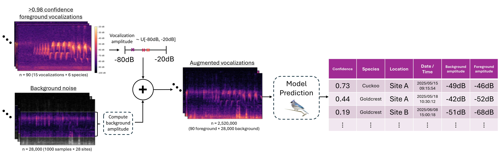

# Noise-Augmented Detectability Estimation (NADE)

Noise-Augmented Detectability Estimation (NADE) is a framework to estimate the impact of site-specific environmental noise on the acoustic detectability of different species.

This repository contains the analysis code and example data associated with the manuscript:  
*Estimating how Site-Level Differences in Acoustic Environments Affect Species Detection by Machine Learning Models*

Preprint: https://doi.org/10.1101/2025.08.31.673350

Dataset: https://doi.org/10.5281/zenodo.17142876

CSV Dataset for replicating figures: https://doi.org/10.5281/zenodo.17289040

---

## 📊 Workflow

Below is the current analysis workflow:  

  

---

## 📂 Repository Structure

```
NADE/
├── data/                # Example dataset 
│   ├── foreground_audio/
│   ├── background_audio/
│   ├── combined_audio/
│   └── output/
├── src/                 # Main analysis code
│   ├── __init__.py
│   ├── combine_audio.py
│   ├── model_inference.py
│   └── background_amplitude.py
├── notebooks/           # Example analysis notebooks
│   └── NADE_demo.ipynb
├── figures/             # Workflow and result figures
├── README.md            # Project overview
└── requirements.yml     # Install requirements
```

---

## 🚀 Getting Started

### 1. **Clone the repository**
```bash
git clone https://github.com/ruarimh/NADE.git
cd NADE
```

### 2. **Install dependencies**
We recommend using a virtual environment.  
Example (with `anaconda`):

```bash
conda env create -f requirements.yml
```

Note that this installs versions of packages that work with BirdNET. For Perch and other models, you may need to edit requirements.yml and adjust the verions of tensorflow, pytorch, or python.

### 3. **Run the analysis notebook**
Open `notebooks/NADE_demo.ipynb` in Jupyter Lab or VS Code.

---

## 🧑‍💻 How to Use the Code

All main analysis functions are in `src/` and can be imported into notebooks or scripts.

**Example: Importing from a notebook**
```python
import sys, os
project_root = os.path.abspath(os.path.join(os.getcwd(), '..'))
if project_root not in sys.path:
    sys.path.insert(0, project_root)

from src.combine_audio import run_combine_audio
from src.model_inference import run_model_inference
from src.background_amplitude import run_background_amplitude_analysis
```

**See `notebooks/NADE_demo.ipynb` for a full workflow example.**

Or, run the code directly in Google Colab using: [](https://colab.research.google.com/github/ruarimh/NADE/blob/main/notebooks/NADE_demo.ipynb)

We extract the date/time from Songmeter Micro filenames of the form "SMM08941_20230422_103000.wav". For other filename formats you'll have to edit parse_songmeter_bg_filename() in background_amplitude.py

---

## 📝 How to Run

- **Combine audio:**  
  Use `run_combine_audio()` to generate combined foreground/background clips and metadata.

- **Compute background amplitudes:**  
  Use `run_background_amplitude_analysis()` to compute bandpass RMS for all foreground/background combinations.

- **Run model inference:**  
  Use `run_model_inference()` to run BirdNET on the combined audio. If you use a model other than BirdNET, you'll have to edit model_inference.py

After running the code, there will be .csv files in data/output that can be merged to show how prediction confidence is related to site, species, vocalization, date/time, and background noise amplitude. 

All paths are built relative to the project root for portability.

---

## 🗂️ Using Your Own Data

1. **Run your own prediction model** on your dataset as usual (e.g., BirdNET, your custom model, etc.).
2. **Select high-confidence detected vocalizations** and annotate them using a tool such as Raven or Audacity to produce a `vocalizations.json` file. These should then be normalized to have the same vocalization amplitude.
   *(See the example in `data/foreground_audio/Meadow Pipit/vocalizations.json` for the required format.)*
3. **Organize your background noise samples** into folders named by site, e.g., `data/background_audio/site_a/`.  
   *We sample background noise randomly across the entire survey duration (e.g., 4am–9pm), but you may wish to sample differently!*
4. **Run the NADE workflow** as described above (see the notebook or scripts for examples).

---

**Tip:**  
If your background audio filenames are not in the Songmeter Micro format (e.g., `SMM08941_20230422_103000.wav`), you will need to edit the `parse_songmeter_bg_filename()` function in `src/background_amplitude.py` to correctly extract date/time information.

---

## 📖 Citation

If you use this code, please cite the associated paper:  
*Estimating how Site-Level Differences in Acoustic Environments Affect Species Detection by Machine Learning Models*

Preprint: https://doi.org/10.1101/2025.08.31.673350

---

## 📜 License

This project is licensed under the [MIT License](LICENSE).  

---

## 📬 Contact

For questions, please contact:  
Ruari Marshall-Hawkes – ram212@cam.ac.uk


